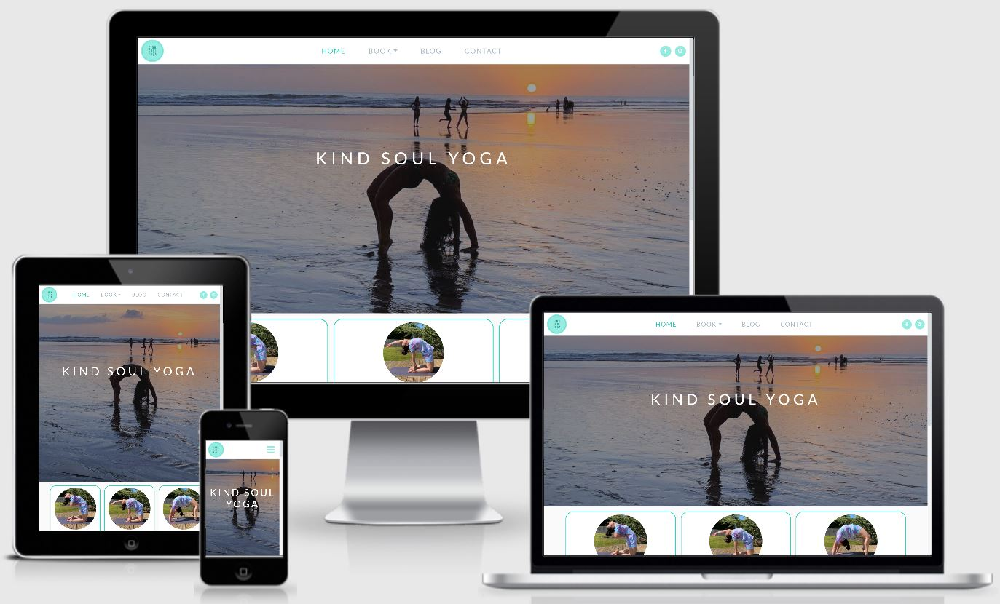
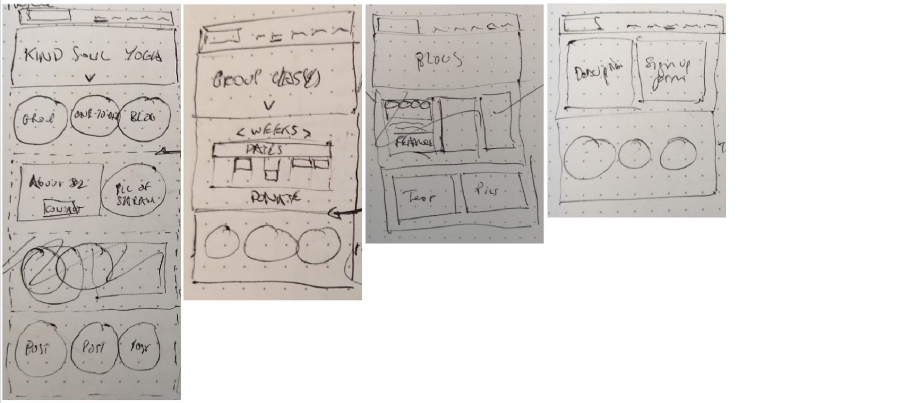
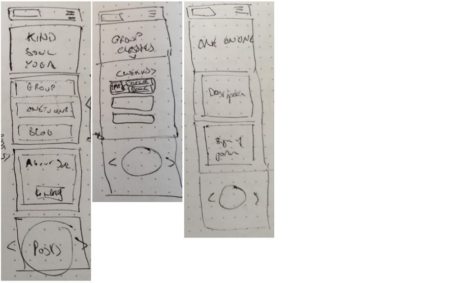
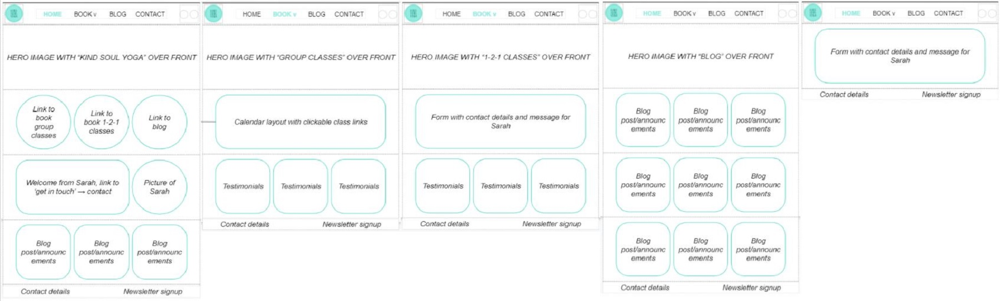
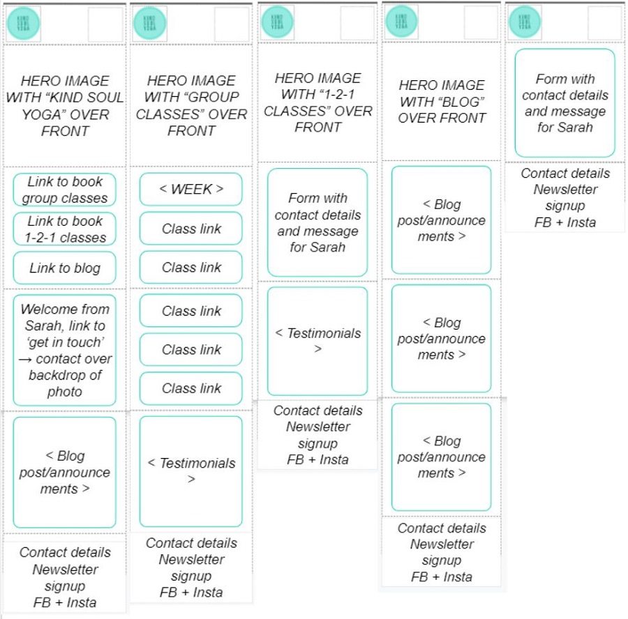
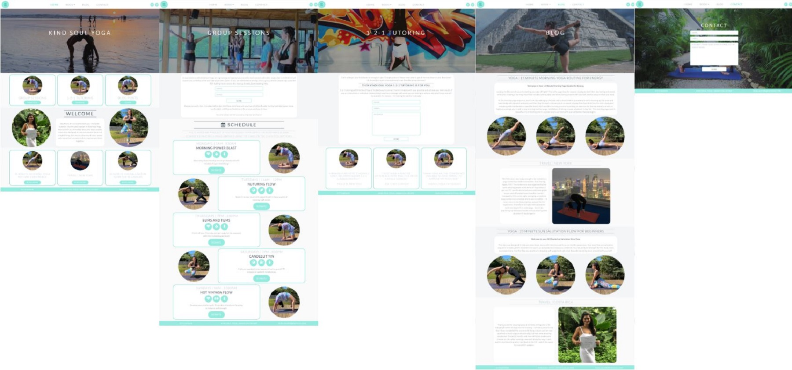
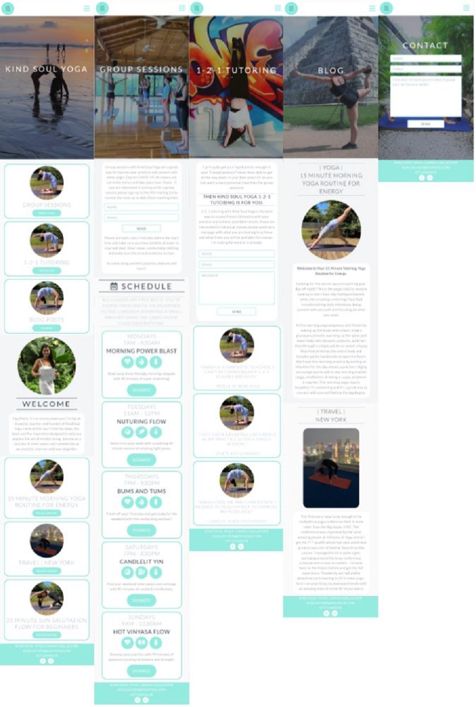

# Kind Soul Yoga

## Code Institute: Milestone Project 1

Kind Soul Yoga is a wellness brand which promotes healthy and mindful living through regular yoga practice. It is run by my friend Sarah Gallacher who has been advertising and managing KSY through social media and Linktree. My aim with this project was to create a platform to allow her to promote her brand more easily and set her apart from other Instagram yoga instructors. The KSY website does just that, while also giving her students a central point of information to find out about class schedules and blog tips. Sarah can now grow her community of yoga enthusiasts, helping them to practice, improve and learn through the different features of the website.

This was the first of four Milestone Projects required to pass the Full Stack Web Development Program at _Code Institute_. The main requirements were to build a static front-end site to present useful information to users using HTML5 and CSS3.

Click [here](https://github.com/zoet24/kind-soul-yoga) to view the Github repository for the project, and click [here](https://zoet24.github.io/kind-soul-yoga/index.html) to view the live website.

## Table of Contents

- [UX Design](#ux-design)
    - [Main aims](#main-aims)
    - [User stories](#user-stories)
        - [Project stakeholder - Sarah Gallacher](#project-stakeholder---sarah-gallacher)
        - [New users](#new-users)
        - [Returning users](#returning-users)
- [Design Process](#design-process)
- [Features](#features)
    - [Existing features](#existing-features)
        - [Consistent features](#consistent-features)
        - [Home](#home)
        - [Group](#group)
        - [1-2-1](#1-2-1)
        - [Blog](#blog)
        - [Contact](#contact)
        - [Features left to implement](#features-left-to-implement)
- [Technologies Used](#technologies-used)
    - [Languages and frameworks](#languages-and-frameworks)
    - [Additional tools used](#additional-tools-used)
- [Testing](#testing)
    - [Testing user stories](#testing-user-stories)
        - [Testing - Project stakeholder](#testing---project-stakeholder)
        - [Testing - New users](#testing---new-users)
        - [Testing - Returning users](#testing---returning-users)
    - [Validating the HTML and CSS code](#validating-the-html-and-css-code)
        - [HTML](#html)
        - [CSS](#css)
    - [Validating the responsiveness](#validating-the-responsiveness)
    - [Validating the accessibility](#validating-the-accessibility)
    - [Validating the functionality of all links](#validating-the-functionality-of-all-links)
- [Deployment](#deployment)
- [Cloning](#cloning)
- [Credits](#credits)

## UX Design

### Main aims

- To provide a platform for Sarah to better promote her Kind Soul Yoga brand.
- To provide a central point of information for Sarah's students to find out about class times and new blog posts.
- To create an aesthetically pleasing website that is in keeping with Sarah's existing brand.
- To create a website that is fully responsive on all screen sizes and devices.

### User stories

I designed the Kind Soul Yoga website with the goals of the site owner (Sarah Gallacher) and the site users in mind. The following user stories helped decide what features to include on the website and what order to present information in.

#### Project stakeholder - Sarah Gallacher

- I am the owner of the Kind Soul Yoga brand and want to promote it through my own website. I want to increase the number of students attending my group classes and 1-2-1 tutoring so I can increase the revenue I make teaching yoga, and I want to grow my community of followers.

#### New users

A. I have a moderate interest in yoga and I would like to improve my practice by attending one of Sarah's group sessions.

B. I have a serious interest in yoga and I would like to improve my practice by booking a 1-2-1 tutoring session with Sarah.

C. I have seen Sarah and the Kind Soul Yoga brand on a social media platform and I would like to read about her lifestyle and her yoga tips.

#### Returning users

A. I am a regular Kind Soul Yoga attendee and I would like to remind myself of the class schedule.

B. I enjoyed one of Sarah's classes and I would like to donate some money.

C. I have enjoyed Sarah's blog posts before and I would like to check if she has posted any new articles.

D. I attended one of Sarah's classes and have a question about the routine she ran through. I would like to contact her for more information.

## Design Process

1. **Strategy plane:** My primary aim for this project was to create an aesthetically pleasing website that satisfied all the goals of the site owner (Sarah Gallacher) and the site users (her community of yogis), and was in keeping with the existing Kind Soul Yoga brand. My secondary aim was to showcase what I had learnt so far from the Code Institute course content and test my ability to write in HTML5 and CSS3. Writing out the User Stories listed above helped me clarify who this project was for and what needed to be included for the website to be a success.
2. **Scope plane:** After establishing the main aims of the project, I started looking at a number of different yoga websites for inspiration on what features to include. The following were particularly useful:

    - [Cityzen Bristol](https://www.cityzenbristol.co.uk/)
    - [Hot Pod Yoga](https://hotpodyoga.com/)
    - [Chrissy Carter Yoga](https://chrissycarter.com/)
    - [Elena Brower Yoga](https://elenabrower.com/)
    - [The Journey Junkie](https://www.thejourneyjunkie.com/)

    From my research I concluded that the website should include:

    - A group class schedule with a small amount of information about each class.
    - Lots of images of Sarah doing yoga.
    - A soothing and non-distracting colour palette.
    - A section that allows the user to contact Sarah directly.

3. **Structure plane:** With my key features in mind, I decided to break up my website into five pages: the Home page with information about the brand and links to the rest of the website, the Group Sessions page with the class schedule and links to donate, the 1-2-1 Tutoring page with an enquiry form, the Blog page with large, responsive images and text bubbles, and the Contact page with another enquiry form.

    To allow easy navigation of the website, I decided I should include a menu bar that remains fixed at the top of the page so the user can always access it instead of having to scroll to the top of the page. I also decided I should include links to other pages in the form of _Call to Action_ buttons so the user has multiple navigation options.

4. **Skeleton plane:** I sketched out my ideas for the desktop and mobile wireframes on paper, and then fleshed it out further in Google Slides (see next section). I used these methods as I was working offline and wanted to get started with the project! I was happy with my initial sketches so I didn't feel the need to redraw them in a more sophisticated software later on, but for future projects I would like to use packages like Balsamiq and Figma to develop the Skeleton and Surface planes. Sketching each allowed me to decide what features I wanted to include, and how the pages would link together.

    I kept my Main Aims and User Stories at the forefront of this process to ensure I was designing a site that was actually going to be useful. An example of how I applied this can be seen in the positioning of the _Call to Action_ section (three links to the Group Sessions, 1-2-1 Tutoring and Blog pages) on the Home page. I initially positioned the _About Sarah_ section above this as I thought it worked well as an introduction to the website. However, I switched the sections around after considering the main goals of the site owner and the majority of site users: Sarah wants more people to sign up to her classes and read her blog posts, and the students want to improve their yoga through practice and advice. While Sarah wants to promote herself to her community and the students want to find out more about Sarah, this is a secondary aim and therefore the _About Sarah_ section should go below the _Call to Action_ section.

5. **Surface plane:** The main aesthetic aim of my project was to be in keeping with the existing Kind Soul Yoga brand - I used this aim as a basis for developing my Surface plane.

Before I started this project, Sarah was using a circular logo with the centrally positioned text "Kind Soul Yoga". The main shades of colours are #95ebe0 (a light turquoise) and #29d4bd (a darker turquoise). The brand name is capitalised and the letters are slightly spaced apart.
    
I used the colours from the logo to develop a wider colour scheme for the whole website using Coolors (you can view the full colour palette [here](https://coolors.co/95ebe0-29d4bd-36454f-a9bbc6-f3f5f6)). I wanted to mirror the circular shape of the logo across the site - all icons, images, buttons and text bubbles are either contained in a circle or have a rounded border. All heading elements - _h1, h2, h3_ and _h4_ - are capitalised and the letters are slightly spaced apart to mirror the text in the logo. I used these design features to flesh out my hand drawn wireframes in Google Slides.

**Note**: I didn't add specific fonts to the website until the very end of the development process. I thought that the default Bootstrap font worked well within the site so I didn't feel the need to specify a different one in my code. However, after deploying my live project and looking at the website on my Huawei P30 Pro mobile phone, I noticed that the font looked different when compared to my laptop browser. I used Google Fonts to select Lato for the headings and Raleway for the content of the website to ensure that the font looks consistent across all devices. For future projects I now know to specify the fonts from the start of the development process.

## Features
### Existing features
#### Consistent features

- The fixed navigation bar at the top of each page and the footer at the bottom of each page are consistent and responsive throughout the website.
- I applied a _hover_ effect to the navigation bar links and all of the buttons throughout the site - when a user scrolls over the link or the button it changes colour, indicating that if they click on it it will take them to another page.
- Each page has a large hero image that takes up most of the page (100% on mobile devices, 80% on large devices) with the page _h1_ heading superimposed on top. The exception is the Contact page where the page title and the enquiry form are superimposed on top together. There is a zoom animation on each hero image that creates a dynamic, eye catching movement when each page is opened.

#### Home

- After the hero image the user sees three _'Calls to Action'_ buttons - links to the Group Sessions, 1-2-1 Tutoring and Blog pages - which will allow them to improve their yoga practice in different ways.
- The user is then presented with a welcome message from Sarah and an introduction to the Kind Soul Yoga brand.
- At the bottom of the page, the user can review the titles of recent blog posts and click on them to read more.

#### Group

- After the hero image the user has the option to sign up to the KSY mailing list to access the most recent class schedule.
- The following section contains information about the timing and content of the classes. The icons and the text convey how difficult the class will be and what sort of yoga will be practiced. Users are encouraged to donate money if they enjoy the class at the top of the section, and there are links to Sarah's Paypal account on each class description to facilitate this.

#### 1-2-1

- After the hero image the user has the option to contact Sarah about 1-2-1 tutoring through the form.
- At the bottom of the page, there are testimonials from previous tutees to encourage users to contact Sarah about 1-2-1 tutoring.

#### Blog

- After the hero image there are numerous blog posts for the user to read through. Some of these contain tips of how to improve your yoga, some contain information about Sarah's lifestyle. All posts are responsive throughout the website.

    **Note:** Sarah doesn't actually have a blog so I had to create the content myself. Some of the content is fictional and was written by me, some of the content is copied from other yoga blogs (in these instances I have commented the source link into the code).

#### Contact

- After the hero image the user has the option to contact Sarah about general enquiries through the form.

#### Features left to implement

- **Blog** ***hover*** **effect:** I wanted to implement a _hover_ effect on the blog post titles on the Home page so that when a user scrolled over a specific post the opening few sentences of the blog post would appear and the user could have a taster of what the article was about. After struggling to get this to work for several hours, I decided that this effect wasn't necessary for the MVP and chose to mirror the layout of the _Call to Action_ section instead to give the sections on the Home page a nice symmetry. This effect would be a nice thing to add in in the future to make the site a little more interactive for the user.
- **Interactive group session calendar:** I wanted to include a calendar widget that would allow the user to scroll through the classes planned for a specific date in the future. However, after considering the main aim of the project - to create a static front-end website - I decided to simplify this idea and have descriptions of five classes that would be run regularly every week instead. This is something I would like to build into the site in the future so that Sarah can advertise a more varied schedule and users can look up classes on specific dates.
- **Colour scheme:** One of the tools I used to test my website was [WAVE - The Web Accessibility Evaluation Tool](https://wave.webaim.org/). While I managed to fix all of the big accessibility errors that it found, it also flagged up that in a lot of areas there is very low contrast between foreground and background colors which would make the site difficult to use for those with low vision. Fixing this would require an overhaul of the aesthetic of the project and unfortunately I didn't have time to do this before the project deadline. This is something I would like to improve on in the future to ensure that the website is fully accessible for all users.

## Technologies used

### Languages and frameworks

- **HTML5:** The language used to create the content and structure of my project.
- **CSS3:** The language used to style the HTML5 elements to represent the Kind Soul Yoga brand.
- **JavaScript:** The language used to make some interactive elements work on my website such as the 'hamburger' icon in the navigation bar.
- **Bootstrap framework:** I used the Bootstrap grid system to make my site responsive on different devices. I also used it for the basic navigation bar, button and form components that I later customised with CSS3.
- **GitHub:** I used GitHub to store my source code and repository.
- **GitHub Pages:** I used GitHub Pages to deploy my project and make it viewable to others.
- **Gitpod:** I used Gitpod's development environment to write the code for my project.

### Additional tools used

- **[Amiresponsive](http://ami.responsivedesign.is/):** I used this to test the responsiveness of my website and to produce the title photo in my README document.
- **[Coolors](https://coolors.co/):** I used Coolors to create the colour palette for my website.
- **[FontAwesome](https://fontawesome.com/):** I used FontAwesome's database to add numerous icons to the Group Sessions page to make it more visually appealing. I also used icons for the Facebook and Instagram links in the navigation bar.
- **Google Developer Tools:** I used this to test the responsiveness of my website by viewing my project on devices with different screen sizes.
- **[Google Fonts](https://fonts.google.com/):** I used two complementary fonts from Google Fonts for my project - Lato and Raleway.
- **Google Slides:** I used Google Slides to flesh out my wireframe sketches.
- **[W3C CSS Validation Service](https://jigsaw.w3.org/css-validator/):** I used this to test to the validity of my CSS code.
- **[W3C Markup Validation Service](https://validator.w3.org/):** I used this to test the validity of my HTML5 code.
- **[WAVE - Web Accessibility Evaluation Tool](https://wave.webaim.org/):** I used this to test the accessibility of my website.

## Testing

### Testing User Stories

#### Testing - Project stakeholder

_I am the owner of the Kind Soul Yoga brand and want to promote it through my own website. I want to increase the number of students attending my group classes and 1-2-1 tutoring so I can increase the revenue I make teaching yoga, and I want to grow my community of followers._

The whole website is in keeping with the existing KSY brand as the aesthetic of the site was based off of the original KSY logo, and therefore allows Sarah to promote the organisation better than she could on non-customisiable social media such as Facebook and Instagram. Having her own website will help Sarah standout over other yoga teachers who are advertising their classes solely through these platforms. The fixed navigation and links on the Home page make it easy for site users to access the Group Sessions and 1-2-1 Tutoring pages - creating a good UX experience navigating to these pages will increase the likelihood of a user donating money for a class or signing up to a tutoring session, thereby increasing Sarah's revenue. The Blog page adds a personal touch to the website which will help Sarah grow her community of followers.

#### Testing - New users

A. _I have a moderate interest in yoga and I would like to improve my practice by attending one of Sarah's group sessions._

B. _I have a serious interest in yoga and I would like to improve my practice by booking a 1-2-1 tutoring session with Sarah._

C. _I have seen Sarah and the Kind Soul Yoga brand on a social media platform and I would like to read about her lifestyle and her yoga tips._

Links to the Group Sessions, 1-2-1 Tutoring and Blog pages are all easily accessible from the Home page, either from the fixed navigation or from the _Call to Action_ section underneath the hero image.

#### Testing - Returning users

A. _I am a regular Kind Soul Yoga attendee and I would like to remind myself of the class schedule._

Links to the Group Sessions page are easily accessible from the Home page, either from the fixed navigation or from the _Call to Action_ section underneath the hero image. The schedule is clearly marked with an _h2_ heading and icon, and the time, type and difficulty of the classes are described in the text bubbles.

B. _I enjoyed one of Sarah's classes and I would like to donate some money._

Links to the Group Sessions page are easily accessible from the Home page, either from the fixed navigation or from the _Call to Action_ section underneath the hero image. Each class description has a _Donate_ button which is larger than the other buttons throughout the website to help them stand out more on the page.

C. _I have enjoyed Sarah's blog posts before and I would like to check if she has posted any new articles._

Links to the Blog page are easily accessible from the Home page, either from the fixed navigation, from the '_Call to Action_' section underneath the hero image or the _Blog Post_ section at the bottom of the page. New blog posts have a thicker text bubble border to draw the user's eye to them.

D. _I attended one of Sarah's classes and have a question about the routine she ran through. I would like to contact her for more information._

The link to the Contact page is easily accessible from the Home page from the fixed navigation. Sarah's contact information is also clearly displayed at the footer of every page.

### Validating the HTML and CSS code

#### HTML

I ran my HTML through the ([W3C Markup Validation Service](https://validator.w3.org/)) which highlighted the following errors:

- **Alt attribute:** As the source links for the majority of the images on the website are listed in the CSS code, I added _alt_ attributes for accessibility next to the _id_ attributes for the image containers. The validator flagged this as an invalid HTML5 syntax, so I removed the _alt_ attributes and replaced them with _span_ elements with an _sr-only_ class.
- **Lang attribute:** I had included the _lang_ attribute inside the _head_ tag instead of the _html_ tag, so there wasn't a language specified on the site.
- **Button syntax:** I had nested _button_ elements inside _anchor_ tags on the Home and Group Sessions pages. The validator flagged this as an invalid HTML5 syntax, so I removed the _button_ element and assigned the _role_ attribute as _button_ to the _anchor_ tag.

#### CSS

I ran my CSS through the ([W3C CSS Validation Service](https://jigsaw.w3.org/css-validator/)) which did not produce any errors.

#### Validating the responsiveness

I manually tested the responsive design of the project by:

- Using Google Developer Tools and ([Amiresponsive](http://ami.responsivedesign.is/)) to view my project on devices with different screen sizes.
- Sharing the live project with friends and family to ask for their feedback.

This highlighted a number of small changes that I need to implement regarding the dimensions, paddings and margins of various elements throughout the website that were targeted by media queries in the CSS.

#### Validating the accessibility

I tested the accessibility of my website using ([WAVE - The Web Accessibility Evaluation Tool](https://wave.webaim.org/)) which highlighted the following errors:

- I had only used _h2, h3_ and _h4_ elements in my HTML so it wasn't clear what the main heading was on each page. To make my code more semantic, I reassigned the main heading as an _h1_.
- The _forms_ on the Group Sessions, 1-2-1 Tutoring and Contact pages didn't have a _label_ attribute so it wasn't clear what each _form input_ was for. I didn't want to add in a visible label so I added a _title_ attribute instead.
- There is very low contrast between a lot of foreground and background colors which would make the site difficult to use for those with low vision. I didn't have time to fix this issue but I have mentioned it in my Features Left To Implement section ( **link** ) as something I would like to rectify in the future.

#### Validating the functionality of all links

I manually tested the links of the website by:

- Ensuring that all social media and donate links opened on the correct page (Facebook, Instagram and Paypal) and in a separate tab.
- Clicking on every navigation link from each page to make sure they take the user to the correct place and that they display as _active_ when selected.
- Clicking on every '_Call To Action_' and _Blog Post - Read More_ button to make sure they take the user to the correct place.

## Deployment

I used GitHub Pages to deploy my website with the following steps:

1. I opened _Settings_ on my project repository in GitHub.
2. I then scrolled to _GitHub Pages_.
3. I selected the _master branch_ as my source.
4. This deployed my project on GitHub Pages and allowed me to share the live website.

More information on Github Pages can be found [here](https://pages.github.com/).

## Cloning

To develop my project further you can clone it to your local machine with the following steps:

1. Scroll to the top of my repository and click on the _Clone or download_ button.
2. Decide whether you want to clone the project using HTTPS or an SSH key.
  1. For HTTPS: click on the checklist icon to the right of the URL.
  2. For SSH key: first click on 'Use SSH' then click on the checklist icon to the right of the URL.
3. Open the _Terminal._
4. Change the current working directory to the destination of the cloned directory.
5. Type "git clone" and then paste the URL you copied earlier.
6. Press _Enter_ to create your local clone.

More information can be found [here](https://docs.github.com/en/enterprise/2.13/user/articles/cloning-a-repository).

## Credits

- **Content:** The majority of this website is fictional but was inspired by content written by Sarah Gallacher. Two blog posts were copied from external yoga websites - these are credited in the HTML comments.
- **Images:** All images were kindly provided by Sarah Gallacher, as was the logo design.
- **Acknowledgements:** A big thank you to the following people who helped with support and guidance throughout this project:
  - Sarah Gallacher for the initial inspiration for this project.
  - My tutor Can Sucullu for his help at various stages.
  - The lovely Code Institute community for their advice on various issues.
  - My friends and family who helped test the deployed website.